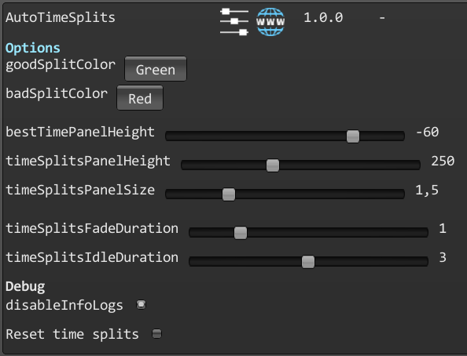

# Auto-time splits

A mod for Art of Rally which adds automaticly generated time splits.

#### Launcher Support

#### Platform Support

## Mechanics

This mod records and displays time splits.\
They are recorded per car class / per stage / per weather and are not shared between car classes, or weathers.

Upon first run completion, no extra panels are displayed.\
When a run has already been recorded, the best time panel will be displayed under the regular timer panel.

Each level is split into 4 sections (3 time splits + final time).\
Time splits are storred into the PlayerPrefs, which is hardly accessible for manual modification.

## Usage

Press Ctrl + F10 to open the mod manager menu.\
Adjust settings to select how time splits display you want.

By default, the mod adds automatic time splits detection and display.

- **goodSplitColor** : will change the color of the text when the split is good (less than previous).
- **badSplitColor** : will change the color of the text when the split is bad (more than previous).

- **bestTimePanelHeight** : will change the height of the best time panel.
- **timeSplitsPanelHeight** : will change the height of the time splits panel.
- **timeSplitsPanelSize** : will change the size of the time splits panel.

- **timeSplitsFadeDuration** : will determine how long the time splits panel will take to fade in and out.
- **timeSplitsIdleDuration** : will determine how long the time splits panel will stay after fading in.

- **disableInfoLogs** : will disable mod info logs in the console.
- **Reset time splits** : will delete all time splits.

Disabling the mod in the manager will hide all time splits displays by default.

## Installation

Follow the [installation guide](https://www.nexusmods.com/site/mods/21/) of
the Unity Mod Manager.\
Then simply download the [latest release](https://github.com/MMike17/AutoTimeSplits/releases/latest)
and drop it into the mod manager's mods page.

## Showcase

## Acknowledgments

Heavily inspired by the [Art of Rally Splits](https://github.com/Theaninova/ArtOfRallySplits) mod made by Theaninova.
